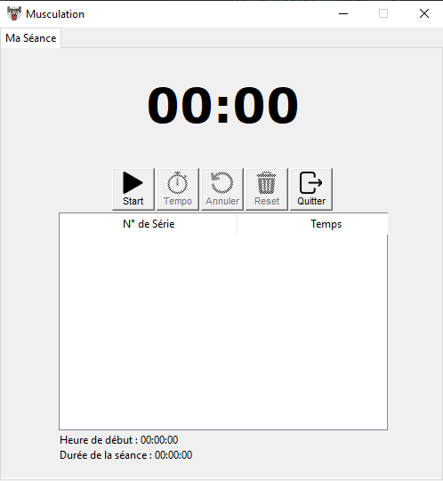

# Workout Assistant
Minimalist interface for your sports sessions. 
All operations are performed localy.

## Table of Contents
1. [Interface](#interface)
2. [More info for developpers](#more-information-for-developpers)

## Interface

### Goal
Count the number of repetitions of your sets of push-ups, squats... and activate a timer between sets.

### Notes
Press space key on keyboard to start a temporisation which is selectable.
Stats can be saved in a csv files when exiting the windows.

## More information for developpers

Checks information regarding sonarqube analysis [on this link](Documentation/forDev.md)
